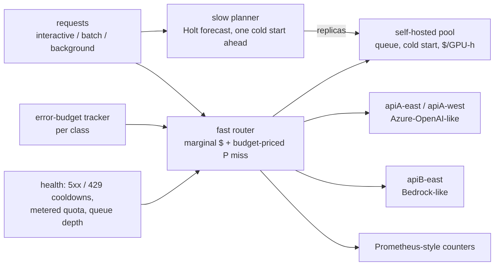

# TITAN FLEET

**SLO-budgeted routing and scaling across managed LLM APIs and self-hosted GPU endpoints.**

An enterprise AI platform serves the same model class from several places at once: managed APIs
(Azure-OpenAI-like, Bedrock-like) with per-deployment token quotas, 429s, regional outages and a price
per token, and self-hosted GPU pools that queue, take minutes to cold-start and bill by the GPU-hour.
Traffic comes in SLO classes (interactive, batch, background) with different targets. Gateways route
and fail over, and autoscalers size the self-hosted pool on its own utilisation, but nothing prices
all of it against one budget. TITAN FLEET is a small control plane that does, plus a deterministic
simulator and a benchmark that scores it against a hindsight oracle.

> v0.1 research prototype. Local only: no model endpoint, cloud account or LLM is called. The fleet is
> simulated, the workload is synthetic, and every latency, quota and price is illustrative, not a
> vendor figure. All numbers below come from `reports/benchmark.md`, regenerated by the commands below.

**Mechanism: the S3 (SLO Service Share) controller.** A slow planner forecasts the self-hosted pool's
demand in concurrent slots and provisions one cold start ahead. A fast router scores each endpoint per
request: marginal $ plus the class's violation price times P(SLO miss). The violation price is the
class penalty times the estimated probability that the class overruns its error budget. Batch and
background may not use the last 25% of a managed quota while interactive's budget is at risk.

**Metric: SLO-Budget Regret (SBR).** J = cost + Σ_class penalty × (violations beyond the error budget);
SBR = J(policy) − J(oracle). The oracle is a linear program that knows every future arrival, latency
draw, outage, quota cut and price change.



## Evidence

25 scenarios (outages, quota cuts, bursts, price changes, cold-start storms, brownouts, load shapes)
× 3 seeds × 9 policies, one simulated hour each, ~3 requests/s
([`reports/benchmark.md`](reports/benchmark.md)). No policy scores below the oracle anywhere.

| Policy | Total SBR ($) | Total cost ($) | Total penalty ($) | S3 has lower SBR in |
|---|---|---|---|---|
| Round robin + HPA | 10810.53 | 1565.68 | 9707.39 | 25/25 |
| Cheapest endpoint + HPA | 11186.92 | 718.73 | 10930.73 | 25/25 |
| Latency-only + HPA | 3771.79 | 1243.7 | 2990.64 | 23/25 |
| Per-provider autoscaling (static failover + HPA) | 10727.4 | 780.24 | 10409.71 | 25/25 |
| Tiered static routing + HPA (extra, stronger baseline) | 3320.88 | 1191.49 | 2591.94 | 23/25 |
| **S3 controller** | **1314.65** | 734.11 | 1043.08 | - |
| S3 without error-budget term (ablation) | 1316.92 | 734.84 | 1044.62 | 18/25 |
| S3 without trend look-ahead (ablation) | 1415.49 | 708.14 | 1169.88 | 8/25 |
| S3 with reactive HPA instead of the planner (ablation) | 1391.82 | 765.53 | 1088.83 | 21/25 |

What this does and does not show:

- **Most of the gap to the four required baselines is true by construction.** They are class-blind, so
  interactive requests wait behind long background jobs in the self-hosted FIFO queue.
  `tiered_static` (interactive to the fastest managed endpoints, everything else cheapest-first) is
  the honest baseline. S3 still has lower total SBR (1314.65 vs 3320.88) at lower total cost
  (734.11 vs 1191.49). Static tiering fails hardest in `brownout_apiA_east` (SBR 800.3373), where it
  keeps interactive pinned to a slowed endpoint.
- **The error-budget term does not earn its keep here.** Removing it changes total SBR from 1314.65 to
  1316.92. The router can only spend error budget where a cheap-but-late route exists, and in this
  fleet those are rare. The oracle spends its budget by shedding load (in `steady` it serves a
  fraction 0.9602 / 0.9604 / 0.9599 of requests on seeds 11 / 12 / 13, per `benchmark.json`); S3 never sheds.
- **The trend look-ahead is a trade-off, not a win.** Without it, S3 is best in 16/25 scenarios, because
  extrapolated noise over-provisions under steady load. With it, total SBR is lower because it matters
  where capacity arrives late: `cold_start_storm` 80.5993 vs 153.3838, `quota_exhaustion` 17.0538 vs 34.366.
- SBR is measured against a relaxation (no queueing inside a minute, no cold start, fractional
  replicas), so it overstates true regret: S3's median SBR is 144.1% of J*.

**Negative cases: S3 loses to the best baseline in 2 of 25 scenarios.**

| Scenario | Best baseline | Baseline SBR | S3 SBR | Why |
|---|---|---|---|---|
| `outage_selfhost` (pool down 10 min) | tiered_static | 59.5168 | 113.3795 | S3 prices the paid-for pool at zero marginal cost and holds managed quota back for interactive. When the pool dies, managed headroom runs out, requests fall back onto the dead pool (507 5xx) and interactive attainment drops to 95.54% |
| `gpu_price_high` (GPU-hour x5) | tiered_static | 29.5829 | 55.6513 | the planner's "pool is cheaper at 80% utilisation" test passes narrowly for interactive, but realised utilisation is lower. S3 keeps 7.531 replica-hours where tiered_static (with HPA) keeps 2.465, and costs 95.7146 vs 69.6462 |

## Quickstart

Python 3.10+.

```bash
python -m venv .venv && . .venv/bin/activate      # Windows: .venv\Scripts\activate
python -m pip install "pytest>=8" "scipy>=1.11"
python -m pytest -q
python -m titan_fleet list                        # scenarios and policies
python -m titan_fleet run outage_selfhost s3      # one run: SLO attainment, SBR, Prometheus text
python -m titan_fleet bench --out reports         # full benchmark (wall_seconds 306.2 on the reference run)
```

`bench` is deterministic: the same commit and seeds reproduce the same report up to the timestamp.

## How it works

- **Simulator** ([`titan_fleet/sim.py`](titan_fleet/sim.py)): discrete-event, per request. Arrivals are
  a non-homogeneous Poisson process per class (thinning), with a compressed diurnal sinusoid and burst
  or ramp windows. Managed endpoints: token-bucket TPM quota → 429, lognormal TTFT and per-token
  latency, price per 1K tokens, outage/quota/price/slow events by endpoint or region. Self-hosted pool:
  replicas × slots as one heap of slot-free times (FIFO), admission control at 120 s of queueing (503),
  cold start, billing from provisioning to drain. Each request carries its latency noise, so every
  policy sees the same draws. At most 3 attempts per request, with cooldowns after 5xx/429/503.
- **Baselines** ([`titan_fleet/policies.py`](titan_fleet/policies.py)): round robin, cheapest endpoint,
  latency-only (EWMA of observed TTFT), and per-provider autoscaling (static failover chain). All four
  use a Kubernetes-HPA-style scaler (70% target, 10% tolerance, 5-minute scale-down stabilisation).
  Every policy, baselines included, gets LiteLLM-style metered-quota filtering and the shared cooldowns.
  `tiered_static` is an extra class-aware baseline.
- **S3**: the planner feeds Little's-law demand (pool slot-seconds of each request that would be cheaper
  on the pool at 80% utilisation than on any SLO-feasible managed endpoint) into Holt's linear
  smoothing and provisions for `max(level + trend × (cold start + tick), outstanding) / (0.8 × slots)`,
  with the same 5-minute scale-down stabilisation. The router computes P(miss) from the pool's actual
  queue, or from a lognormal tail around observed managed latency. The violation price is the
  penalty × P(class exceeds half its error budget by the end of the SLO window). The window is declared
  configuration (the run length), not foresight; the other half of the budget is kept for incidents.
- **Oracle** ([`titan_fleet/oracle.py`](titan_fleet/oracle.py)): per-minute fluid LP solved with HiGHS
  (scipy). Variables: the fraction of each class/minute cell served by each endpoint in each minute
  (deferral allowed within the class deadline), fractional pool replicas per minute, and budget
  overrun per class. Constraints: quotas, pool slot-seconds, outage availability, and only
  requests that would actually be on time count as served.
- **Metrics**: `run` prints the run's counters in Prometheus text exposition format.

## Prior art and what is not new

Checked 2026-09-29. All four papers cited in the project brief resolve on arXiv.

- **AutoSLO** (Markakis & Kraska, arXiv 2607.11770): a forecast-driven policy tuner, a reactive
  autoscaler and an online router at three timescales, for cloud data warehouses. S3's
  planner/router split is this pattern transferred to LLM fleets.
- **Cross-Model Autoscaling / TRE** (arXiv 2609.29160): a demand-normalised Token Service Share signal
  and SLO-driven replica rebalancing across co-hosted models under a fixed GPU budget. S3's
  slot-demand signal is the same idea for one pool; TRE handles many models, S3 does not.
- **OpScale** (arXiv 2608.13499): operator-level provisioning inside self-hosted serving. Finer-grained
  than anything here.
- **Multi-Tier SLA Scheduling** (arXiv 2608.16336): more than two priority tiers inside a Llumnix-based
  scheduler. S3 routes by class but does not reorder a pool's queue.
- **LiteLLM router**: TPM/RPM-aware deployment filtering, cost- and latency-based routing, fallbacks
  and cooldowns. These are standard; every baseline here gets the quota filter and cooldowns.
- **Envoy AI Gateway + Gateway API Inference Extension**: metric-aware endpoint picking for self-hosted
  pools alongside model-as-a-service providers, with provider fallback. **llm-d** (its Workload
  Variant Autoscaler, SLO- and cost-aware across accelerator types, is now deprecated in favour of
  KEDA), the **vLLM production stack** (KEDA) and **Ray Serve LLM** (custom autoscaling policies) scale
  self-hosted pools on inference metrics. Azure-style provisioned-to-pay-as-you-go spillover is a
  gateway pattern. RouteLLM routes between models of different quality, which is orthogonal (quality
  is not modelled).
- Error budgets and burn rates come from Google's SRE practice.

No mature tool found implements the whole loop, so the lab's kill switch did not trigger. The narrower
claim that remains: one controller that prices managed tokens, GPU-hours, quota headroom and per-class
error budgets together, plus a reproducible SBR benchmark against a hindsight LP. It is an engineering
combination, not a new algorithm, and its budget component shows no measurable benefit in this benchmark.

## Limitations

- Simulated fleet, synthetic workload, illustrative parameters. Results depend on the price and
  latency ratios chosen (at full utilisation the self-hosted pool is several times cheaper per request
  than the managed endpoints; see the fleet in `titan_fleet/bench.py`).
  No public trace is used: the Azure LLM inference trace was considered, but downloading it was not
  approved in this build.
- Controller parameters were set by looking at seed 7 on the same 25 scenarios; the reported seeds
  (11-13) were not used during development, but the scenarios were. There is no held-out scenario set.
- The router reads the pool's exact queue state, and a request's lateness is known when it is admitted.
  Real systems see delayed, noisy queue metrics.
- All endpoints are assumed to serve an equivalent model; there are no residency constraints, no
  per-tenant quotas and no priority inside the self-hosted queue.
- The oracle is a relaxation, so SBR is an upper bound on true regret and includes an irreducible part.
- The budget window is the run length. With a 30-day SLO window the budget behaves differently.

## Layout

```
titan_fleet/sim.py        domain model, workload generator, discrete-event simulator
titan_fleet/policies.py   baselines, HPA, S3 controller and ablations
titan_fleet/oracle.py     hindsight fluid LP (scipy HiGHS)
titan_fleet/bench.py      fleet, 25 scenarios, benchmark, report, provenance
titan_fleet/__main__.py   CLI and Prometheus text output
reports/                  generated evidence (JSON + Markdown)
docs/THREAT_MODEL.md      trust boundaries and what a real deployment must add
```

## Next (v0.2)

Mock provider services on a local Kubernetes/Container Apps emulator, real Azure/Bedrock adapters
behind opt-in credentials, a public trace for arrivals, load shedding that spends error budget the way
the oracle does, and residency and model-equivalence constraints as hard filters.

MIT licensed.
