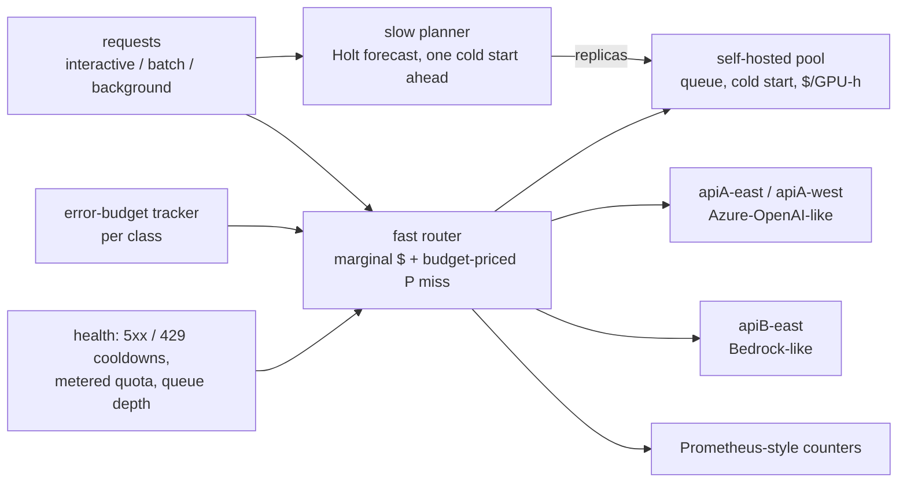

# TITAN FLEET

**Gateways route and autoscalers scale, but nothing prices managed LLM APIs, self-hosted GPU pools and per-class SLO error budgets against one budget.**

One controller that routes each request and sizes the GPU pool by marginal dollars plus the budget-priced
risk of an SLO miss, measured by its regret against a hindsight LP oracle.

> v0.1 research prototype. Local only: no model endpoint, cloud account or LLM is called. The fleet is
> simulated, the workload is synthetic, and every latency, quota and price is illustrative, not a
> vendor figure. All benchmark numbers below come from [`reports/benchmark.md`](reports/benchmark.md).



## Worked example

A managed-provider outage: `apiA-east` returns 5xx for every request from minute 20 to minute 35.
S3 against `latency_only`, the best of the baselines in this scenario, on the default seed (11):

```text
$ python -m titan_fleet run outage_apiA_east s3
{
 "requests": 10878,
 "objective": 21.9937,
 "cost": 21.9937,
 "penalty": 0.0,
 "oracle_objective": 9.0627,
 "sbr": 12.931,
 "classes": {
  "interactive": {
   "requests": 5351,
   "violations": 6,
   "attainment": 0.9989,
   "error_budget": 53.5,
   "overrun": 0.0,
   "p95_ttft": 0.488,
   "p99_ttft": 0.719
  },
...
titan_endpoint_errors_total{scenario="outage_apiA_east",policy="s3",endpoint="apiA-east",status="5xx"} 0
...
titan_cost_usd_total{scenario="outage_apiA_east",policy="s3",endpoint="apiA-east"} 1.0582
titan_cost_usd_total{scenario="outage_apiA_east",policy="s3",endpoint="apiA-west"} 0.0147
titan_cost_usd_total{scenario="outage_apiA_east",policy="s3",endpoint="apiB-east"} 0.3772
titan_cost_usd_total{scenario="outage_apiA_east",policy="s3",endpoint="selfhost-east"} 20.5436

$ python -m titan_fleet run outage_apiA_east latency_only
{
 "requests": 10878,
 "objective": 72.6112,
 "cost": 39.8612,
 "penalty": 32.75,
 "oracle_objective": 9.0627,
 "sbr": 63.5485,
 "classes": {
  "interactive": {
   "requests": 5351,
   "violations": 119,
   "attainment": 0.9778,
   "error_budget": 53.5,
   "overrun": 65.5,
   "p95_ttft": 0.927,
   "p99_ttft": 1.501
  },
...
titan_endpoint_errors_total{scenario="outage_apiA_east",policy="latency_only",endpoint="apiA-east",status="5xx"} 27
...
titan_cost_usd_total{scenario="outage_apiA_east",policy="latency_only",endpoint="apiA-east"} 11.1811
titan_cost_usd_total{scenario="outage_apiA_east",policy="latency_only",endpoint="apiA-west"} 9.6636
titan_cost_usd_total{scenario="outage_apiA_east",policy="latency_only",endpoint="apiB-east"} 4.8067
titan_cost_usd_total{scenario="outage_apiA_east",policy="latency_only",endpoint="selfhost-east"} 14.2098
```

Both policies see the same 10878 requests and the same latency draws, and are scored against the same
oracle (J* = 9.0627). `latency_only` sends 27 attempts into the outage and misses the 1.2 s interactive
TTFT target 119 times against a budget of 53.5: 65.5 violations over budget × $0.5 = $32.75 penalty, on
top of higher spend. S3 misses 6, has no 5xx, and keeps most traffic on the pool it already pays for.
This is one seed; the report's mean over seeds 11–13 is 12.5192 vs 50.1381, and the same pair scores
13.5036 vs 46.7788 in `steady`, so most of this gap is not caused by the outage (see
[What this result does not establish](#what-this-result-does-not-establish)).

## Results

25 scenarios × 3 seeds × 9 policies, one simulated hour each, ~3 requests/s. No policy scores below the
oracle anywhere.

| Policy | Total SBR ($) | Median SBR / J* | Total cost ($) | Total penalty ($) | Best in | S3 has lower SBR in |
|---|---|---|---|---|---|---|
| Round robin + HPA | 10810.53 | 2754.0% | 1565.68 | 9707.39 | 0/25 | 25/25 |
| Cheapest endpoint + HPA | 11186.92 | 1951.6% | 718.73 | 10930.73 | 0/25 | 25/25 |
| Latency-only + HPA | 3771.79 | 544.3% | 1243.7 | 2990.64 | 0/25 | 23/25 |
| Per-provider autoscaling (static failover + HPA) | 10727.4 | 1500.3% | 780.24 | 10409.71 | 0/25 | 25/25 |
| Tiered static routing + HPA (extra, stronger baseline) | 3320.88 | 451.5% | 1191.49 | 2591.94 | 2/25 | 23/25 |
| **S3 controller** | **1314.65** | 144.1% | 734.11 | 1043.08 | 3/25 | - |
| S3 without error-budget term (ablation) | 1316.92 | 144.8% | 734.84 | 1044.62 | 2/25 | 18/25 |
| S3 without trend look-ahead (ablation) | 1415.49 | 142.6% | 708.14 | 1169.88 | 16/25 | 8/25 |
| S3 with reactive HPA instead of the planner (ablation) | 1391.82 | 160.4% | 765.53 | 1088.83 | 2/25 | 21/25 |

- Against `tiered_static`, the honest class-aware baseline, S3 has lower total SBR (1314.65 vs 3320.88)
  at lower total cost (734.11 vs 1191.49). Static tiering fails hardest in `brownout_apiA_east`
  (SBR 800.3373), where it keeps interactive pinned to a slowed endpoint.
- **The error-budget term does not earn its keep here.** Removing it changes total SBR from 1314.65 to
  1316.92. The router can only spend error budget where a cheap-but-late route exists, and in this
  fleet those are rare. The oracle spends its budget by shedding load (in `steady` it serves a
  fraction 0.9602 / 0.9604 / 0.9599 of requests on seeds 11 / 12 / 13, per `benchmark.json`); S3 never sheds.
- **The trend look-ahead is a trade-off, not a win.** Without it, S3 is best in 16/25 scenarios, because
  extrapolated noise over-provisions under steady load. With it, total SBR is lower because it matters
  where capacity arrives late: `cold_start_storm` 80.5993 vs 153.3838, `quota_exhaustion` 17.0538 vs 34.366.

**Negative cases: S3 loses to the best baseline in 2 of 25 scenarios.**

| Scenario | Best baseline | Baseline SBR | S3 SBR | Why |
|---|---|---|---|---|
| `outage_selfhost` (pool down 10 min) | tiered_static | 59.5168 | 113.3795 | S3 prices the paid-for pool at zero marginal cost and holds managed quota back for interactive. When the pool dies, managed headroom runs out, requests fall back onto the dead pool (507 5xx) and interactive attainment drops to 95.54% |
| `gpu_price_high` (GPU-hour x5) | tiered_static | 29.5829 | 55.6513 | the planner's "pool is cheaper at 80% utilisation" test passes narrowly for interactive, but realised utilisation is lower. S3 keeps 7.531 replica-hours where tiered_static (with HPA) keeps 2.465, and costs 95.7146 vs 69.6462 |

Per-scenario SBR, SLO attainment, p99 TTFT, 429/5xx counts and replica-hours are in
[`reports/benchmark.md`](reports/benchmark.md); the machine-readable version is
[`reports/benchmark.json`](reports/benchmark.json).

## Quickstart

Python 3.10+.

```bash
python -m venv .venv && . .venv/bin/activate      # Windows: .venv\Scripts\activate
python -m pip install "pytest>=8" "scipy>=1.11"
python -m pytest -q
python -m titan_fleet list                        # scenarios and policies
python -m titan_fleet run outage_apiA_east s3     # one run: SLO attainment, SBR, Prometheus text
python -m titan_fleet bench --out reports         # full benchmark, about 5 minutes
```

## Mechanism

An enterprise AI platform serves the same model class from several places at once: managed APIs
(Azure-OpenAI-like, Bedrock-like) with per-deployment token quotas, 429s, regional outages and a price
per token, and self-hosted GPU pools that queue, take minutes to cold-start and bill by the GPU-hour.
Traffic comes in SLO classes (interactive, batch, background) with different targets. Gateways route
and fail over, and autoscalers size the self-hosted pool on its own utilisation, but neither prices
the whole fleet against one budget.

**The S3 (SLO Service Share) controller** ([`titan_fleet/policies.py`](titan_fleet/policies.py)) has two loops.

- **Slow planner** (every tick): feeds Little's-law demand (pool slot-seconds of each request that would
  be cheaper on the pool at 80% utilisation than on any SLO-feasible managed endpoint) into Holt's linear
  smoothing and provisions for `max(level + trend × (cold start + tick), outstanding) / (0.8 × slots)`,
  with a 5-minute scale-down stabilisation.
- **Fast router** (every request): scores each endpoint as marginal $ plus the class's violation price
  times P(SLO miss). P(miss) comes from the pool's actual queue, or from a lognormal tail around
  observed managed latency. The violation price is the penalty × P(class exceeds half its error budget
  by the end of the SLO window). The window is declared configuration (the run length), not foresight;
  the other half of the budget is kept for incidents. Pool capacity is priced at zero marginal cost,
  because the planner owns the pool's cost.
- **Quota-aware spillover**: batch and background may not use the last 25% of a managed quota while
  interactive's budget is at risk.
- **Metrics**: `run` prints the run's counters in Prometheus text exposition format.

## Threat and failure model

v0.1 calls no endpoint, holds no credential and changes no infrastructure. The threats that matter are
those a real deployment of the controller would face: class spoofing (a tenant labels background work
interactive to buy priority and managed quota), budget exhaustion as denial of service, runaway
scaling from forecast error or a hostile burst, residency violations and silent failover to a
different model on failover, retry storms, and a tampered report presented as evidence. v0.1 controls
retries (at most 3 attempts, cooldowns), clamps replicas and saturates the violation price at the class
penalty; class spoofing, residency and model equivalence are not controlled. Full table:
[`docs/THREAT_MODEL.md`](docs/THREAT_MODEL.md).

**Failure taxonomy covered by the 25 scenarios** (definitions in [`titan_fleet/bench.py`](titan_fleet/bench.py)):

| Failure class | How the simulator produces it | Scenarios |
|---|---|---|
| Managed-endpoint outage | every attempt returns 5xx for the window (30 s cooldown) | `outage_apiA_east`, `outage_region_west`, `burst_during_outage` |
| Region outage (pool and managed) | all endpoints in `east` return 5xx | `outage_region_east` |
| Self-hosted pool outage | pool returns 5xx for 10 minutes | `outage_selfhost` (**S3 loses**) |
| Quota cut / exhaustion | token-bucket TPM quota scaled down; empty bucket returns 429 (5 s cooldown) | `quota_cut_apiA`, `quota_exhaustion` |
| Brownout (slow, no errors) | endpoint latency multiplied | `brownout_apiA_east`, `selfhost_degraded` |
| Price change | managed price or GPU-hour price multiplied | `price_drop_apiB`, `price_spike_apiA`, `gpu_price_high` (**S3 loses**) |
| Cold start | pool cold start raised to 15 minutes during a burst | `cold_start_storm` |
| Pool saturation | admission control returns 503 above 120 s of queueing (5 s cooldown) | whichever runs overload the pool (per-run counts in `benchmark.json`) |
| Bursts and load shape | per-class rate multipliers, ramps, square waves, class mixes | `steady`, `diurnal`, `burst_3x_5min`, `burst_interactive_4x`, `batch_flood`, `flash_crowd_8x_90s`, `slow_ramp`, `square_wave`, `low_load`, `high_load`, `interactive_only`, `background_heavy` |

Not covered: flapping or partial error rates (outages are clean on/off windows), lying or delayed
health signals, rate limits other than TPM (no RPM), per-tenant quotas, class spoofing, residency and
model-equivalence failures, and failures of the controller itself.

## Experiment design

- **Simulator** ([`titan_fleet/sim.py`](titan_fleet/sim.py)): discrete-event, per request. Arrivals are
  a non-homogeneous Poisson process per class (thinning), with a compressed diurnal sinusoid and burst
  or ramp windows. Managed endpoints: token-bucket TPM quota → 429, lognormal TTFT and per-token
  latency, price per 1K tokens, outage/quota/price/slow events by endpoint or region. Self-hosted pool:
  replicas × slots as one heap of slot-free times (FIFO), admission control at 120 s of queueing (503),
  cold start, billing from provisioning to drain. Each request carries its latency noise, so every
  policy sees the same draws. At most 3 attempts per request, with cooldowns after 5xx/429/503.
- **Workload**: 25 scenarios × seeds 11, 12, 13, one simulated hour each, ~3 requests/s. SLO classes:
  interactive TTFT 1.2 s at 99% ($0.5 per violation over budget), batch end-to-end 60 s at 95% ($0.1),
  background end-to-end 600 s at 90% ($0.02).
- **Tuning vs held-out**: controller parameters were set by looking at seed 7 on the same 25 scenarios;
  the reported seeds (11–13) were not used during development. The scenarios were; there is no held-out
  scenario set.
- **Baselines** ([`titan_fleet/policies.py`](titan_fleet/policies.py)), all with a Kubernetes-HPA-style
  scaler (70% target, 10% tolerance, 5-minute scale-down stabilisation) and LiteLLM-style metered-quota
  filtering and cooldowns:
  - naive: round robin;
  - prior-art-inspired: cheapest endpoint and latency-only (EWMA of observed TTFT), after LiteLLM's
    cost- and latency-based routing; per-provider autoscaling (static failover chain, self-hosted first),
    after gateway fallback configs; and `tiered_static`, an extra class-aware baseline (interactive to the
    fastest managed endpoints, everything else cheapest-first), as a LiteLLM model-group-per-tier config
    would express it.
- **Ablations**: S3 without the error-budget term (every violation priced at the full penalty), without
  the trend look-ahead, and with the reactive HPA instead of the planner.
- **Oracle** ([`titan_fleet/oracle.py`](titan_fleet/oracle.py)): per-minute fluid LP solved with HiGHS
  (scipy), with full hindsight of every arrival, latency draw, outage, quota cut and price change.
  Variables: the fraction of each class/minute cell served by each endpoint in each minute (deferral
  allowed within the class deadline), fractional pool replicas per minute, and budget overrun per class.
  Constraints: quotas, pool slot-seconds, outage availability, and only requests that would actually be
  on time count as served.
- **Metric: SLO-Budget Regret (SBR).** J = cost + Σ_class penalty × (violations beyond the error budget);
  SBR = J(policy) − J(oracle).
- **Regenerate**:

  ```bash
  python -m titan_fleet bench --out reports                         # all 25 scenarios, seeds 11-13
  python -m titan_fleet bench --only quota_exhaustion --out build/reports  # a subset
  python -m titan_fleet run <scenario> <policy> --seed 12           # one run
  ```

  `bench` is deterministic: the same commit and seeds reproduce the same report up to the timestamp and
  wall-clock time. The report records commit SHA, command, Python and scipy versions, scenario hash and
  UTC time. The reference run took `wall_seconds` 306.2 on one Windows machine; wall-clock time is
  machine-dependent.

## What this result does not establish

- **That S3 beats class-aware routing by a wide margin in general.** Most of the gap to the four
  class-blind baselines is true by construction: interactive requests wait behind long background jobs
  in the self-hosted FIFO queue. `tiered_static` is the honest comparison (3320.88 vs 1314.65 total SBR).
- **Any real-world saving or latency figure.** Latencies, quotas and prices are illustrative, not vendor
  prices. Results depend on the ratios chosen: at full utilisation the self-hosted pool is several times
  cheaper per request than the managed endpoints (see the fleet in `titan_fleet/bench.py`).
- **Behaviour on real traffic.** Arrivals are synthetic. No public trace is used: the Azure LLM inference
  trace was considered, but downloading it was not approved in this build.
- **Generalisation to unseen incidents.** Parameters were tuned on the same 25 scenarios (seed 7); only
  the seeds are held out.
- **Performance with realistic telemetry.** The router reads the pool's exact queue state, and a request's
  lateness is known when it is admitted. Real systems see delayed, noisy queue metrics.
- **That error-budget pricing helps.** The ablation without it scores 1316.92 vs 1314.65.
- **True regret.** The oracle is a relaxation (no queueing inside a minute, no cold start, fractional
  replicas), so SBR is an upper bound on true regret and includes an irreducible part: S3's median SBR
  is 144.1% of J*.
- **Behaviour over a real SLO window.** The budget window is the run length (one hour). With a 30-day
  SLO window the budget behaves differently.

## Limitations

- All endpoints are assumed to serve an equivalent model; there are no residency constraints, no
  per-tenant quotas and no priority inside the self-hosted queue.
- One self-hosted pool and one model class; S3 does not rebalance replicas across models.
- S3 never sheds load, so it cannot spend error budget the way the oracle does.
- S3 prices the pool at zero marginal cost, which is what makes it fragile when the pool itself fails
  (`outage_selfhost`) or when GPU-hours are expensive (`gpu_price_high`).
- Request classes are trusted; nothing derives class from workload identity.

## Research lineage

Checked 2026-09-29. All four papers cited in the project brief resolve on arXiv.

- **AutoSLO** (Markakis & Kraska, arXiv 2607.11770): a forecast-driven policy tuner, a reactive
  autoscaler and an online router at three timescales, for cloud data warehouses. S3's
  planner/router split is this pattern transferred to LLM fleets.
- **Cross-Model Autoscaling / TRE** (arXiv 2609.29160): a demand-normalised Token Service Share signal
  and SLO-driven replica rebalancing across co-hosted models under a fixed GPU budget. S3's
  slot-demand signal is the same idea for one pool; TRE handles many models, S3 does not.
- **OpScale** (arXiv 2608.13499): operator-level provisioning inside self-hosted serving. Finer-grained
  than anything here.
- **Multi-Tier SLA Scheduling** (arXiv 2608.16336): more than two priority tiers inside a Llumnix-based
  scheduler. S3 routes by class but does not reorder a pool's queue.
- **LiteLLM router**: TPM/RPM-aware deployment filtering, cost- and latency-based routing, fallbacks
  and cooldowns. These are standard; every baseline here gets the quota filter and cooldowns.
- **Envoy AI Gateway + Gateway API Inference Extension**: metric-aware endpoint picking for self-hosted
  pools alongside model-as-a-service providers, with provider fallback. **llm-d** (its Workload
  Variant Autoscaler, SLO- and cost-aware across accelerator types, is now deprecated in favour of
  KEDA), the **vLLM production stack** (KEDA) and **Ray Serve LLM** (custom autoscaling policies) scale
  self-hosted pools on inference metrics. Azure-style provisioned-to-pay-as-you-go spillover is a
  gateway pattern. RouteLLM routes between models of different quality, which is orthogonal (quality
  is not modelled).
- Error budgets and burn rates come from Google's SRE practice.

No mature tool found implements the whole loop, so the lab's kill switch did not trigger. The narrower
claim that remains: one controller that prices managed tokens, GPU-hours, quota headroom and per-class
error budgets together, plus a reproducible SBR benchmark against a hindsight LP. It is an engineering
combination, not a new algorithm, and its budget component shows no measurable benefit in this benchmark.

## Roadmap

v0.2: mock provider services on a local Kubernetes/Container Apps emulator, real Azure/Bedrock adapters
behind opt-in credentials, a public trace for arrivals, load shedding that spends error budget the way
the oracle does, and residency and model-equivalence constraints as hard filters.

## Layout

```
titan_fleet/sim.py        domain model, workload generator, discrete-event simulator
titan_fleet/policies.py   baselines, HPA, S3 controller and ablations
titan_fleet/oracle.py     hindsight fluid LP (scipy HiGHS)
titan_fleet/bench.py      fleet, 25 scenarios, benchmark, report, provenance
titan_fleet/__main__.py   CLI and Prometheus text output
reports/                  generated evidence (JSON + Markdown)
docs/THREAT_MODEL.md      trust boundaries and what a real deployment must add
```

MIT licensed.
